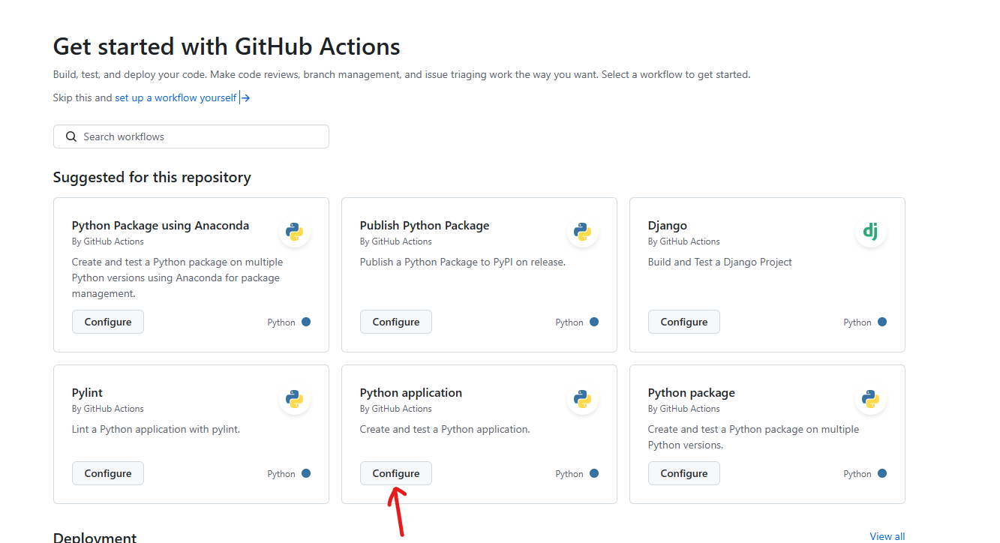

# Instruction

Add the unit test `test_calc.py`

```python
import pytest
from calc import *

def test_add():
    assert add(3,4)==7

def test_sub():
    assert sub(3,4)==-1
```

In terminal, you may run the unit test using the command "pytest".


Under the "Action" tab, in the GitHub repository, click "New Workflow". Select "Configure" under  "Python application".



Preview the Github workflow `python-app.yml`. click Commit.


Whenever there are changes commit to the "main" branch, the GitHub Action will be triggered to run the automated test using pytest.
